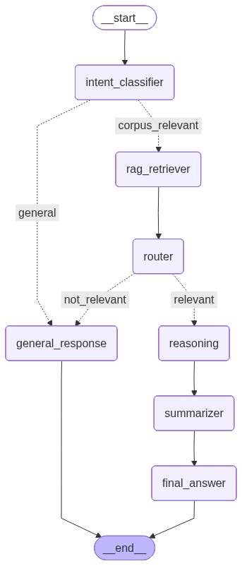

# Agentic Reasoning Framework for German Nuclear Documents

[](https://opensource.org/licenses/MIT)

A multi-agent system that answers complex questions about German nuclear decommissioning documents using iterative reasoning and retrieval-augmented generation (RAG).

## Quick Setup

```bash
# Clone the repository
git clone https://github.com/DataScienceLabFHSWF/agentic-reasoning-framework.git
cd agentic-reasoning-framework

# Install dependencies with uv
uv sync
```

## Detailed Setup & Usage

The system processes documents through several stages before you can query them:

### 1. Document Processing Pipeline

The repository includes raw PDF files that need to be processed:

**Step 1: Convert PDFs to Markdown**
```bash
python run_individual_components/run_doc_processor.py
```
This converts the raw PDF files to structured Markdown (.md) files.

**Step 2: Vectorize Documents**
```bash
python run_individual_components/run_vectorizer.py
```
This vectorizes the .md files and stores them in a Chroma DB vector store.

**Step 3: Test Retrievers (Optional)**
```bash
python run_individual_components/run_retrievers.py
```
You can run individual retrievers to test chunk retrieval from the vector store.

**Step 4: Run the RAG Chat Workflow**
```bash
python run_individual_components/run_rag_chat.py
```
This assembles the entire LangGraph workflow to run the agentic RAG chat.

### 2. Why "Agentic"?

The system is **agentic** because the agent can autonomously decide whether to fetch more context during the reasoning process. This "RAG-as-a-tool" approach allows the agent to:
- Determine if initial retrieved context is sufficient
- Request additional document chunks when needed
- Iterate through reasoning steps with selective retrieval

### 3. Running the Streamlit Interface

The RAG chat is wrapped in a user-friendly Streamlit frontend.

```bash
cd src/agent-rag-streamlit
streamlit run streamlit_app.py
```

**Example Questions:**
- `Welches Unternehmen betreibt das Kernkraftwerk Grafenrheinfeld (KKG)?`
- `Welcher Reaktortyp ist das Kernkraftwerk Grafenrheinfeld?`
- `Was ist die thermische Leistung des Kernkraftwerks?`

## What it does

This framework uses multiple AI agents working together to:
- Classify whether questions are relevant to the document corpus
- Retrieve the most relevant document sections
- Reason through complex, multi-step problems
- Generate accurate, concise answers

The system is specifically designed for German-language technical documents in the nuclear safety domain.

## How it works



The system has 5 main components:

1. **Intent Agent** - Decides if a question is relevant to the documents
2. **Retriever Agent** - Finds relevant document sections using hybrid search
3. **Router Agent** - Checks if retrieved documents are good enough to answer
4. **Reasoning Agent** - Works through the problem step-by-step, can fetch more info
5. **Answer Agents** - Summarize findings and extract final answers

## Dataset

We created **German-Nuclear-Decom-QA** with 45 questions across 3 difficulty levels:

| Level | Questions | What they test | Avg Time |
|-------|-----------|----------------|----------|
| Simple | 15 | Direct facts from documents | 25 seconds |
| Medium | 15 | Connecting info, simple math | 45 seconds |
| Hard | 15 | Multi-document reasoning | 115 seconds |

Example questions:
- "What reactor type is the Grafenrheinfeld nuclear power plant?" (Simple)
- "How many years between the first nuclear reaction and KKG-BELLA startup?" (Medium)
- "Is the nearest town to KRB II more than 5km away?" (Hard)

## Performance

### Against baselines:
| Model | Exact Match | Near Match |
|-------|-------------|------------|
| GPT-4 | 73.3% | 82.2% |
| Gemini | 80.0% | 91.1% |
| **Our System** | 42.2% | 60.0% |

### By difficulty:
| Level | Success Rate | Tool Usage |
|-------|-------------|------------|
| Simple | 86.7% | 0 tools |
| Medium | 73.3% | 0.9 tools |
| Hard | 60.0% | 1.8 tools |

## Key findings

- **Semantic understanding works better than exact matching** (73% vs 47% success)
- **Harder questions need more tools and time** (1.8 tools for hard vs 0 for simple)
- **67% of questions solved without additional tool calls**
- **Processing time ranges from 16 to 187 seconds**

## Installation

```bash
git clone https://github.com/your-username/agentic-reasoning-framework.git
cd agentic-reasoning-framework
pip install -r requirements.txt
```

## Usage

Run the analysis:
```bash
python analyze_results.py --results_file results.json --qa_dataset gpt_qa_datasets_de.json
```

This generates:
- Excel report with detailed metrics
- Performance charts and heatmaps  
- Question-by-question breakdown

## What's next

- Expand the dataset with more question types
- Add fine-tuned models for better German processing
- Improve multi-hop reasoning for complex questions
- Integrate calculation tools for numerical problems

## Why this matters

This shows that multi-agent systems can handle complex reasoning tasks in specialized domains, even in non-English languages. The modular design makes it reliable for safety-critical applications where you can't depend on a single AI model.

## Detailed Results

<details>
<summary>Click to view detailed question-by-question results (45 questions)</summary>

<div style="overflow-x: auto;">

| # | Dataset | Difficulty | Question | Expected Answer | Provided Answer | Exact | Near | Semantic | Tools | Time (s) |
|---|---------|------------|----------|-----------------|-----------------|-------|------|----------|-------|----------|
| 1 | dataset1 | simple | Welcher Reaktortyp ist das Kernkraftwerk Graf... | Druckwasserreaktor | PWR | ❌ | ❌ | ✅ | 0 | 27.8 |
| 2 | dataset1 | simple | Welches Unternehmen betreibt das Kernkraftwer... | E.ON Kernkraft GmbH | E.ON Kernkraft GmbH | ✅ | ✅ | ✅ | 0 | 16.3 |
| 3 | dataset1 | simple | In welchem Jahr ging das Kernkraftwerk Grafen... | 1982 | 1982 | ✅ | ✅ | ✅ | 0 | 16.1 |
| 4 | dataset1 | simple | Wie heißt das Standort‑Zwischenlager am KKG, ... | KKG‑BELLA | KKG-BELLA | ✅ | ✅ | ✅ | 0 | 21.5 |
| 5 | dataset1 | simple | Wofür steht die Abkürzung RBZ in den KKG‑Unte... | Reststoffbehandlungs... | Reststoffbehandlungsz... | ❌ | ✅ | ✅ | 0 | 15.7 |
| 6 | dataset1 | medium | Welche Art von Brennstoff verwendet das Kernkr... | Brennstäbe aus Urandio... | Uran | ❌ | ❌ | ✅ | 0 | 16.8 |
| 7 | dataset1 | medium | Welche Komponenten sind im Reaktordruckbehält... | Reaktorkern, Dampferzeu... | Reaktorkern, Dampferzeu... | ✅ | ✅ | ✅ | 0 | 22.4 |
| 8 | dataset1 | medium | Welches Bauunternehmen war hauptverantwortlic... | Kraftwerk Union AG | Kraftwerk Union AG | ✅ | ✅ | ✅ | 0 | 16.4 |
| 9 | dataset1 | medium | Was ist die thermische Leistung des Kernkraft... | 3765 MW | 3765 MW | ✅ | ✅ | ✅ | 0 | 16.2 |
| 10 | dataset1 | medium | Wie hoch ist die elektrische Bruttoleistung d... | 1345 MW | 1345 MW | ✅ | ✅ | ✅ | 0 | 16.2 |
| 11 | dataset1 | hard | Berechne die Differenz zwischen der thermisch... | 2420 MW | 2420 MW | ✅ | ✅ | ✅ | 0 | 16.6 |
| 12 | dataset1 | hard | Welche Sicherheitssysteme sind im KKG install... | Notkühlsystem, Containm... | Notkühlsystem, Containm... | ✅ | ✅ | ✅ | 0 | 16.1 |
| 13 | dataset1 | hard | Welche Maßnahmen wurden zur Stilllegung und z... | Entfernung radioaktiver... | Entfernung radioaktiver... | ✅ | ✅ | ✅ | 2 | 187.3 |
| 14 | dataset1 | hard | Was ist der Status des KKG nach der Stilllegun... | Rückbau‑ und Entsorgung... | Rückbau‑ und Entsorgung... | ✅ | ✅ | ✅ | 1 | 67.1 |
| 15 | dataset1 | hard | Welche langfristigen Überwachungsmaßnahmen si... | Umgebungsüberwachung, S... | Umgebungsüberwachung un... | ❌ | ✅ | ✅ | 3 | 136.7 |
| 16 | dataset2 | simple | Welcher Reaktortyp ist das Kernkraftwerk Gund... | Siedewasserreaktor | Siedewasserreaktor | ✅ | ✅ | ✅ | 0 | 17.0 |
| 17 | dataset2 | simple | Welches Unternehmen betreibt das Kernkraftwer... | RWE Power AG | RWE Power AG | ✅ | ✅ | ✅ | 0 | 16.2 |
| 18 | dataset2 | simple | In welchem Jahr wurde das Kernkraftwerk Gundr... | 1966 | 1966 | ✅ | ✅ | ✅ | 0 | 16.2 |
| 19 | dataset2 | simple | Wann wurde das Kernkraftwerk Gundremmingen Bl... | 1984 | 1984 | ✅ | ✅ | ✅ | 0 | 16.0 |
| 20 | dataset2 | simple | Welche Abkürzung wird für die Kernkraftwerke ... | KRB | KRB | ✅ | ✅ | ✅ | 0 | 15.9 |
| 21 | dataset2 | medium | Welche Art von Brennstoff wird in den Kernkra... | Uran | Uran | ✅ | ✅ | ✅ | 0 | 16.1 |
| 22 | dataset2 | medium | Was ist die thermische Leistung von KRB II? | 3840 MW | 3840 MW | ✅ | ✅ | ✅ | 0 | 16.2 |
| 23 | dataset2 | medium | Welches Unternehmen war für den Bau von KRB I... | General Electric und Kr... | General Electric | ❌ | ❌ | ❌ | 0 | 16.4 |
| 24 | dataset2 | medium | Wie hoch ist die elektrische Nettoleistung vo... | 1344 MW | 1344 MW | ✅ | ✅ | ✅ | 0 | 16.1 |
| 25 | dataset2 | medium | Welche Kühlmethode wird in KRB II verwendet? | Flusswasserkühlung | Flusswasserkühlung | ✅ | ✅ | ✅ | 0 | 16.3 |
| 26 | dataset2 | hard | Berechne die Differenz zwischen der thermisch... | 2496 MW | 2496 MW | ✅ | ✅ | ✅ | 0 | 22.1 |
| 27 | dataset2 | hard | Welche Sicherheitssysteme sind in KRB II inst... | Notkühlsystem, Containm... | Notkühlsystem, Containm... | ❌ | ❌ | ❌ | 1 | 73.6 |
| 28 | dataset2 | hard | Was waren die Hauptgründe für die Stilllegung... | Wirtschaftlichkeit und ... | Wirtschaftlichkeit, Umw... | ❌ | ✅ | ✅ | 1 | 109.7 |
| 29 | dataset2 | hard | Welche Maßnahmen wurden zur Dekontamination u... | Entfernung kontaminiert... | Entfernung kontaminiert... | ❌ | ❌ | ❌ | 1 | 59.0 |
| 30 | dataset2 | hard | Welche Herausforderungen gibt es beim Rückbau... | Entsorgung radioaktiver... | Entsorgung radioaktiver... | ❌ | ❌ | ❌ | 2 | 78.1 |
| 31 | dataset3 | simple | Welcher Reaktortyp ist das Kernkraftwerk Krüm... | Siedewasserreaktor | Siedewasserreaktor | ✅ | ✅ | ✅ | 0 | 16.6 |
| 32 | dataset3 | simple | Welches Unternehmen betreibt das Kernkraftwer... | PreussenElektra | PreussenElektra | ✅ | ✅ | ✅ | 0 | 16.2 |
| 33 | dataset3 | simple | In welchem Jahr wurde das Kernkraftwerk Krümm... | 1983 | 1983 | ✅ | ✅ | ✅ | 0 | 16.1 |
| 34 | dataset3 | simple | Was ist die Abkürzung für das Kernkraftwerk K... | KKK | KKK | ✅ | ✅ | ✅ | 0 | 16.0 |
| 35 | dataset3 | simple | Wann wurde das Kernkraftwerk Krümmel endgülti... | 2021 | 2021 | ✅ | ✅ | ✅ | 0 | 33.4 |
| 36 | dataset3 | medium | Welche Art von Brennstoff wird im Kernkraftwe... | Urandioxid‑Brennstäbe | Urandioxid‑Brennstäbe | ✅ | ✅ | ✅ | 0 | 16.6 |
| 37 | dataset3 | medium | Welches Bauunternehmen war hauptverantwortlic... | Kraftwerk Union AG | Kraftwerk Union AG | ✅ | ✅ | ✅ | 0 | 16.2 |
| 38 | dataset3 | medium | Was ist die thermische Leistung des Kernkraft... | 3690 MW | 3690 MW | ✅ | ✅ | ✅ | 0 | 16.2 |
| 39 | dataset3 | medium | Wie hoch ist die elektrische Bruttoleistung d... | 1402 MW | 1402 MW | ✅ | ✅ | ✅ | 0 | 16.1 |
| 40 | dataset3 | medium | Welche Kühlmethode wird im Kernkraftwerk Krüm... | Elbe‑Flusswasserkühlung | Flusswasserkühlung aus ... | ❌ | ✅ | ✅ | 0 | 16.7 |
| 41 | dataset3 | hard | Berechne die Differenz zwischen der thermisch... | 2288 MW | 2288 MW | ✅ | ✅ | ✅ | 0 | 29.9 |
| 42 | dataset3 | hard | Welche besonderen Sicherheitssysteme sind im ... | Notkühlsystem, Sicherhe... | Notkühlsystem, Sicherhe... | ❌ | ✅ | ✅ | 1 | 69.6 |
| 43 | dataset3 | hard | Was sind die Hauptschritte bei der Stilllegun... | Brennelementent‑fernung... | Brennelementent‑fernung... | ❌ | ✅ | ✅ | 3 | 102.8 |
| 44 | dataset3 | hard | Welche Umweltüberwachungsmaßnahmen werden wäh... | Radioaktivitätsmessunge... | Radioaktivitätsmessunge... | ❌ | ✅ | ✅ | 2 | 92.6 |
| 45 | dataset3 | hard | Was sind die langfristigen Ziele für das Gele... | Grüne Wiese, vollständi... | Grüne Wiese | ❌ | ❌ | ✅ | 2 | 72.7 |

</div>

**Legend:**
- ✅ = Correct/Match
- ❌ = Incorrect/No Match  
- **Exact**: Perfect word-for-word match
- **Near**: Close match with minor differences
- **Semantic**: Meaning is correct even if wording differs

</details>

## Citation

```bibtex
@inproceedings{rao2024agentic,
  title={An Open-Source Agentic Reasoning Framework for German Nuclear Documents},
  author={Rao, Rohil and Kopinski, Thomas},
  year={2024}
}
```

*University of Applied Sciences Südwestfalen*
